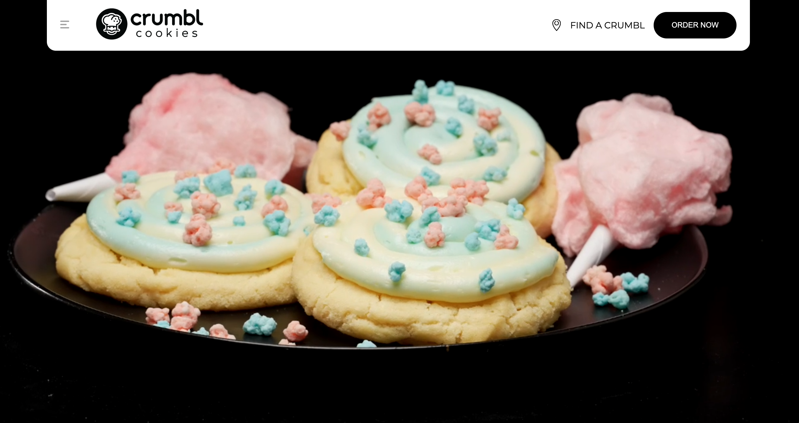
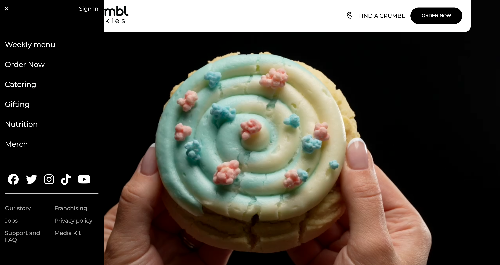
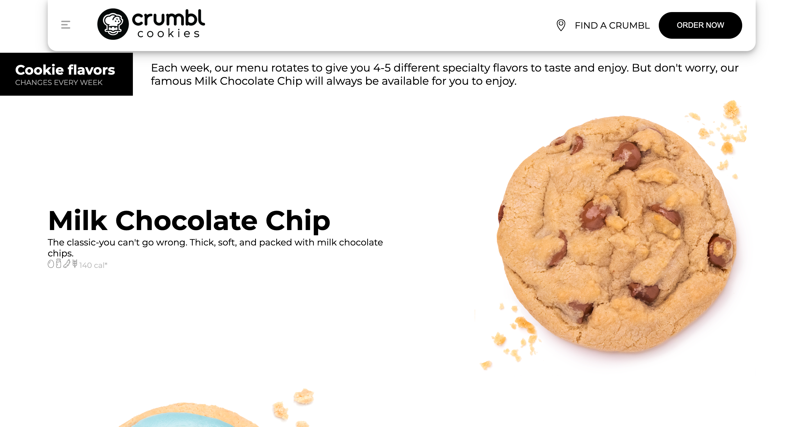

# Crumbl Cookie Desktop Clone

## Table of contents

- [Overview](#overview)
  - [The challenge](#the-challenge)
  - [Screenshot](#screenshot)
  - [Links](#links)
- [My process](#my-process)
  - [Built with](#built-with)
  - [What I learned](#what-i-learned)
- [Author](#author)

## Overview

### The challenge

Users should be able to:

- View the desktop version of the Crumbl website.

### Screenshot

### Links

- Solution URL: [View Github Code](https://github.com/jchapar/crumbl_clone)
- Live Site URL: [Visit Site](https://jchapar.github.io/crumbl_clone/)

## My process

### Built with

- Semantic HTML5 markup
- CSS custom properties
- SASS
- Flexbox
- Grid CSS
- Vanilla JavaScript

### What I learned

- Continued with SASS and customizing classes.
- JavaScript functionality added for the toggle menu.

## Author

- Frontend Mentor - [@jchapar](https://www.frontendmentor.io/profile/jchapar)
- Twitter - [@j_chapar](https://www.twitter.com/j_chapar)
